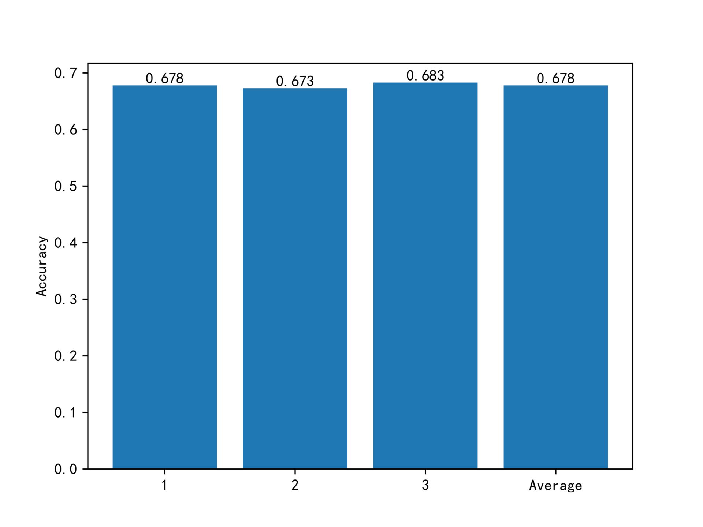
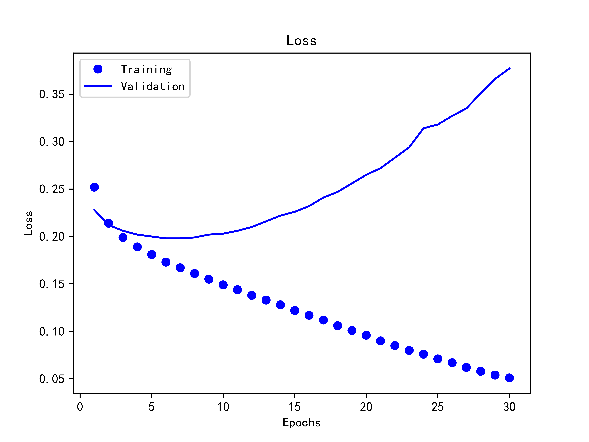
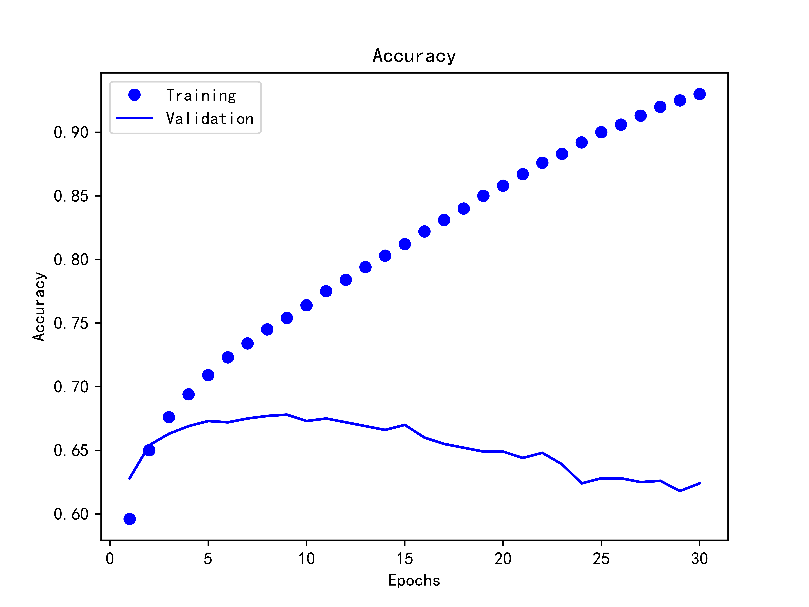

# Rotten-Tomatoes

烂番茄电影评论打分

> 华中科技大学 Python大数据与人工智能实践作业

### 数据集

https://www.kaggle.com/c/sentiment-analysis-on-movie-reviews/data

### 项目模块结构

代码仓库结构：

```plain
.
└── Rotten-Tomatoes
    ├── data                   # 数据集
    ├── docs                   # 作业要求
    ├── images                 # 文档中的图片
    ├── README.md              # 说明文档
    ├── src                    # 代码
    └── visual                 # 可视化
```

`src` 目录代码模块依赖结构：

```plain
.
├── tomato.py
│   ├── classifier.py
│   └── dataset.py
└── test.py
```

`tomato.py` 用于训练和验证数据集，它依赖于 `dataset` 和 `classifier` 这两个模块：
- `dataset` - 数据集，用于简化对数据的操作，并利用 `BertTokenizer` 对其进行分词。
- `classifier` - 分类器，使用 BERT 模型对评论进行分类。

```console
$ cd src
$ python tomato.py                              # 训练和验证
```

`test.py` 则利用已经训练保存的模型 `bert.model`  对输入的新评论进行打分预测，例如：

```console
$ python test.py "I think it's pretty good!"    # 试试新评论
```

### 准确度

重复三次“训练集/验证集划分、训练、测试”，三次的平均准确率为 0.678 ：



运行 30 个 Epoch 的 Loss 和 Accuracy 曲线：

 | 
--- | ---
