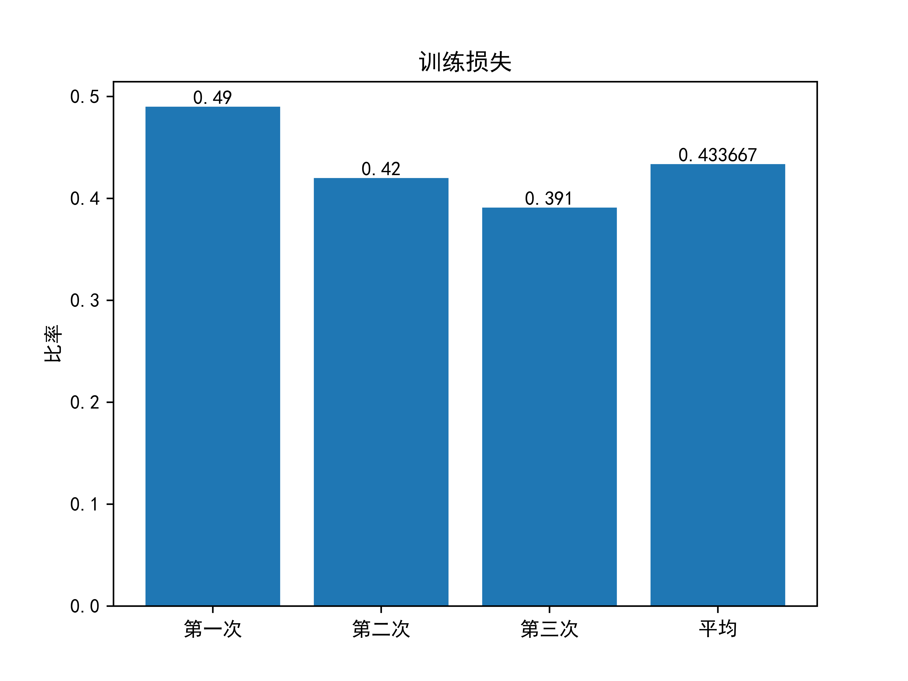
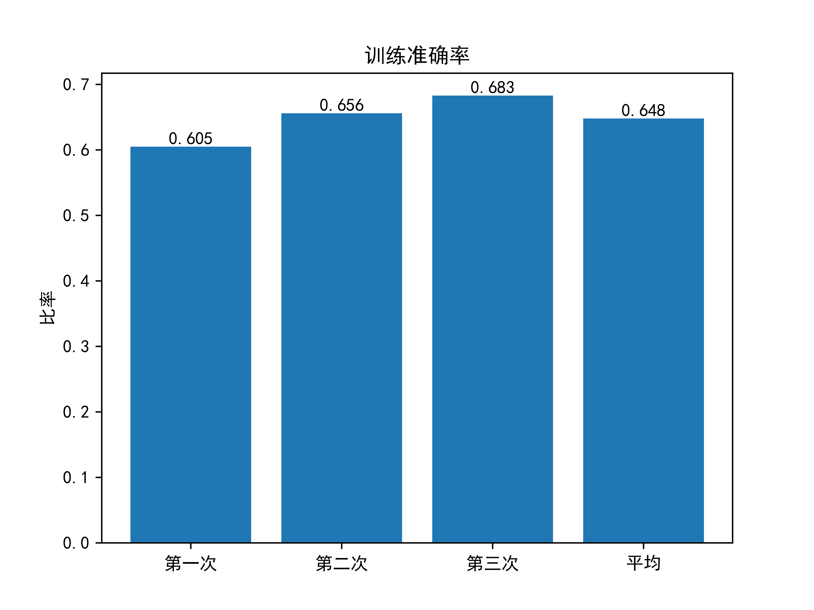
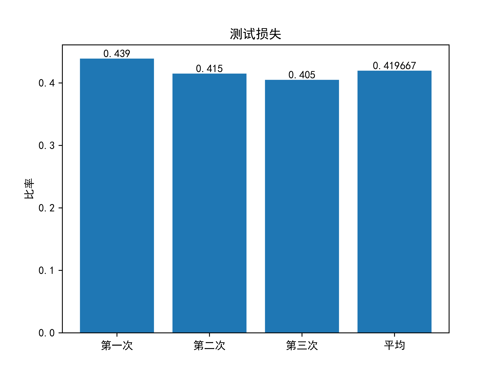
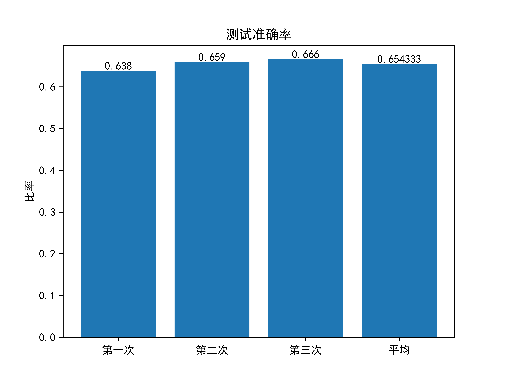

# Rotten-Tomatoes

烂番茄电影评论打分

> 华中科技大学 Python大数据与人工智能实践作业

### 数据集

https://www.kaggle.com/c/sentiment-analysis-on-movie-reviews/data

### 运行

```console
$ cd data
$ python tomato.py
```

### 测试

```console
$ cd data
$ python test.py {YOUR_PHRASE}
```

### 准确度

```plain
Epochs: 1 | Training Loss:  0.490 | Training Accuracy:  0.605 | Validation Loss:  0.439 | Validation Accuracy:  0.638
Epochs: 2 | Training Loss:  0.420 | Training Accuracy:  0.656 | Validation Loss:  0.415 | Validation Accuracy:  0.659
Epochs: 3 | Training Loss:  0.391 | Training Accuracy:  0.683 | Validation Loss:  0.405 | Validation Accuracy:  0.666

Average accuracy of 3 times:  0.654
```





