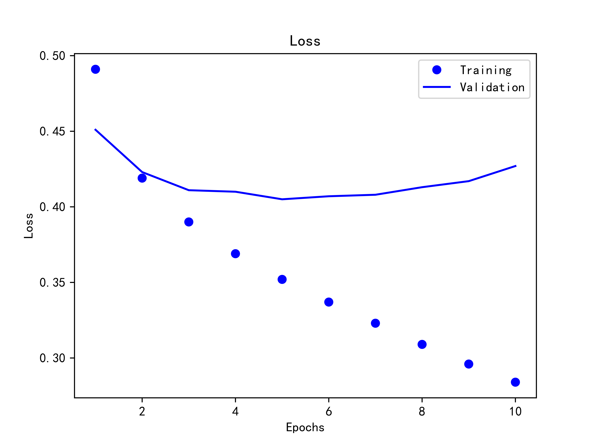
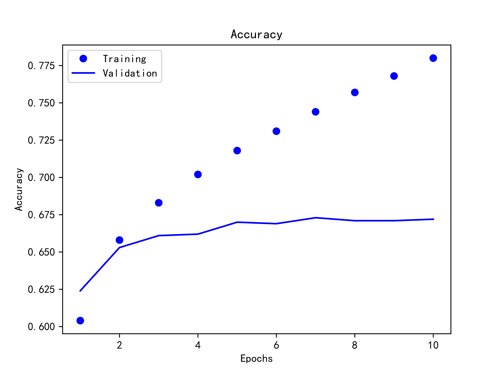

# Rotten-Tomatoes

烂番茄电影评论打分

> 华中科技大学 Python大数据与人工智能实践作业

### 数据集

https://www.kaggle.com/c/sentiment-analysis-on-movie-reviews/data

### 训练与验证

```console
$ cd data
$ python tomato.py
```

### 准确度

```plain
Epochs: 1 | Train Loss:  0.491 | Train Accuracy:  0.604 | Test Loss:  0.451 | Test Accuracy:  0.624
Epochs: 2 | Train Loss:  0.419 | Train Accuracy:  0.658 | Test Loss:  0.423 | Test Accuracy:  0.653
Epochs: 3 | Train Loss:  0.390 | Train Accuracy:  0.683 | Test Loss:  0.411 | Test Accuracy:  0.661
Epochs: 4 | Train Loss:  0.369 | Train Accuracy:  0.702 | Test Loss:  0.410 | Test Accuracy:  0.662
Epochs: 5 | Train Loss:  0.352 | Train Accuracy:  0.718 | Test Loss:  0.405 | Test Accuracy:  0.670
Epochs: 6 | Train Loss:  0.337 | Train Accuracy:  0.731 | Test Loss:  0.407 | Test Accuracy:  0.669
Epochs: 7 | Train Loss:  0.323 | Train Accuracy:  0.744 | Test Loss:  0.408 | Test Accuracy:  0.673
Epochs: 8 | Train Loss:  0.309 | Train Accuracy:  0.757 | Test Loss:  0.413 | Test Accuracy:  0.671
Epochs: 9 | Train Loss:  0.296 | Train Accuracy:  0.768 | Test Loss:  0.417 | Test Accuracy:  0.671
Epochs: 10 | Train Loss:  0.284 | Train Accuracy:  0.780 | Test Loss:  0.427 | Test Accuracy:  0.672
```




### 测试

```console
$ cd data
$ python test.py {YOUR_PHRASE}
```
