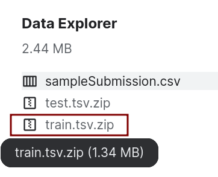

# 大作业：烂番茄电影评论打分

## 数据集准备
- 烂番茄电影评论（Rotten Tomatoes movie review）数据集：a corpus of movie reviews used for  sentiment analysis.
    - dataset: https://www.kaggle.com/c/sentiment-analysis-on-movie-reviews/data
    - The dataset is comprised of tab-separated files with phrases from the Rotten Tomatoes  dataset.
- The sentiment labels are:
    1. negative
    2. somewhat negative
    3. neutral
    4. somewhat positive
    5. positive



训练数据：train.tsv

| Phraseld    | Sentenceld    | Phrase    | Sentiment |
|----- | ---- | ------------------------------------------------------------------------------- | ----- |
| 1    | 1    | A series of escapades demonstrating the adage that  what is good for the goose is also good for the gander ,  some of which occasionally amuses but none of which  amounts to much of a story .                                                                | 1     |
| 2    | 1    | A series of escapades demonstrating the adage that what is good for the goose   | 2     |
| 3    | 1    | A series                                                                        | 2     |
| 4    | 1    | A                                                                               | 2     |
| 5    | 1    | series                                                                          | 2     |
| 6    | 1    | of escapades demonstrating the adage that what is good for the goose            | 2     |
| 7    | 1    | of                                                                              | 2     |
| 8    | 1    | escapades demonstrating the adage that what is good  for the goose              | 2     |
| 9    | 1    | escapades                                                                       | 2     |
| 10   | 1    | demonstrating the adage that what is good for the  goose                        | 2     |


## 大作业要求

### 基本内容
- 从训练数据（train.tsv）中随机划分训练集（data\_train）与验证集（data\_val）
- 使用训练集训练模型，预测验证集中每个phrase的标签
- 重复三次“训练集/验证集划分、训练、测试”，汇报三次的平均准确率
- 数据集划分：
```pytorch
from sklearn.model_selection import train_test_split
data_train, data_val = train_test_split(data, test_size = 0.1)
```

### 其他要求
- 可组队：不多于3人
- 提交时间：2022.12.31
- 提交内容：可运行复现的pytorch代码，运行说明，作业报告（pdf）
- 打分依据
    - 平均准确率 + 算法实验报告
    - 同组同分
