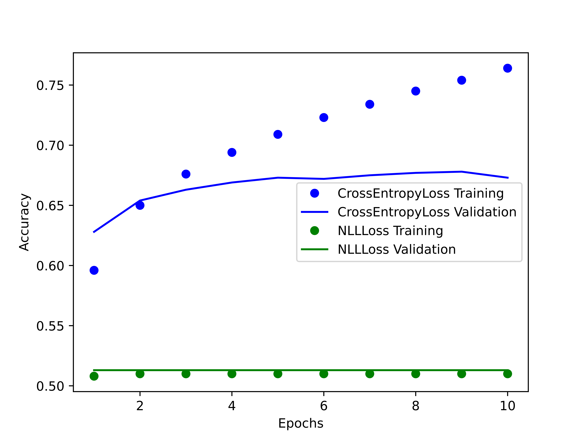
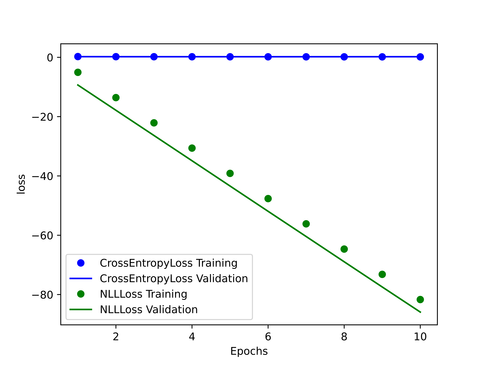
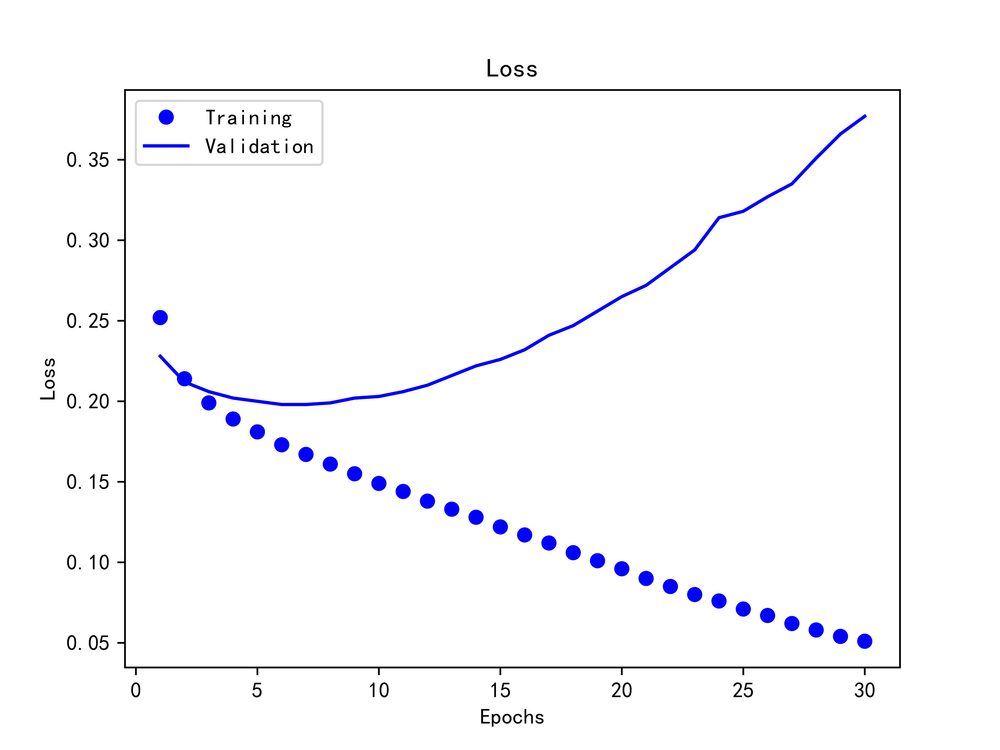
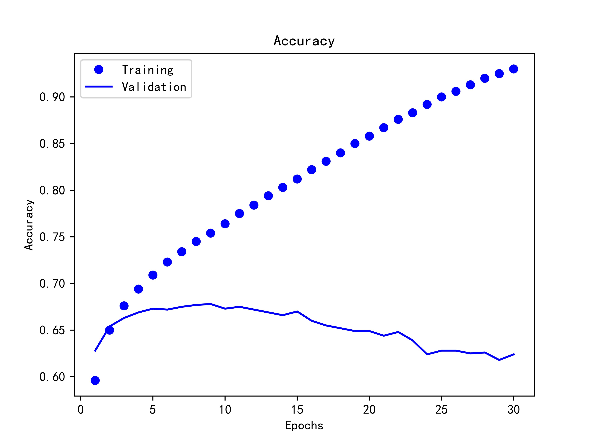
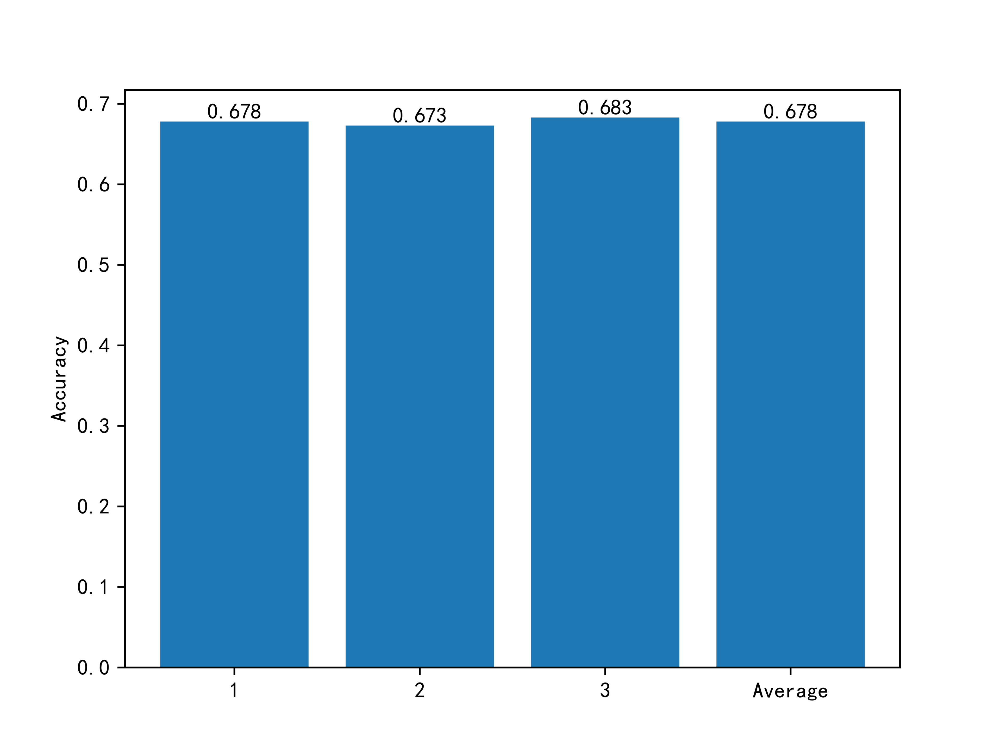

# 总体概况

重复三次“训练集/验证集划分、训练、测试”，三次的平均准确率为 0.678 。

## 实验背景和目的

人工智能 (AI) 作为新一轮科技革命和产业变革的重要驱动力量，正在深刻影响着世界历史进程。人工智能领域中的诸多名词如“机器学习”、“深度学习”、“神经网络”等，早已从概念提出到走向繁荣。自然语言处理 (NLP) 则是当前人工智能领域的皇冠。同时，这个时代也是大数据的时代，对海量数据的处理离不开离不开人工智能，尤其是自然语言处理。

这次实验要求根据“烂番茄”网站电影评论数据集训练模型，预测验证集中每个phrase的标签。

重复三次“训练集/验证集划分、训练、测试”，汇报三次的平均准确率。

## 总体设计思路

基于 Google 公司推出的 BERT 模型实现，使用 `transformers` 库中的 `BertTokenizer` 进行分词，使用 `BertModel` 进行训练。

在调参策略上，由于掌握的计算资源较为丰富，可以尝试较多种类的参数组合，使用了 Shell 脚本结合 Python 命令行参数的方式自动化完成了各种参数的训练，并使用 Matplotlib 库进行可视化比较，最终确定参数组合。

## 项目模块结构

代码仓库结构：

```plain
.
├── data                   # 数据集
├── docs                   # 作业要求
├── images                 # 文档中的图片
├── README.md              # 说明文档
├── src                    # 代码
└── visual                 # 可视化
```

代码依赖结构：

```plain
.
├── tomato.py
│   ├── classifier.py
│   └── dataset.py
└── test.py
```

`tomato.py` 用于训练和验证数据集，它依赖于 `dataset` 和 `classifier` 这两个模块：
- `dataset` - 数据集，用于简化对数据的操作，并利用 `BertTokenizer` 对其进行分词。
- `classifier` - 分类器，使用 BERT 模型对评论进行分类。

```console
$ python tomato.py
```

`test.py` 则利用已经训练保存的模型 `bert.model`  对输入的新评论进行打分预测，例如：

```console
$ python test.py "I think it's pretty good!"
```

# 环境介绍

## 开发环境

- **CPU**: AMD Ryzen 7 5800H with Radeon Graphics
- **OS**: Fedora Linux 36 (Thirty Six) x86\_64
- **Kernel**: 6.0.18-200.fc36.x86\_64

在实验开始之初直接使用轻薄本编写代码并运行 python 项目，发现运行速度很慢。

后改用服务器和拥有独显的笔记本运行，轻薄本只用于编写代码。

## 测试环境

### 机器配置

- **CPU**: AMD Ryzen 7 5800H
- **GPU**: NVIDIA GeForce RTX 3060 Laptop GPU
- **CUDA**: 11.6
- **Python3**: 3.10.4
- **Conda**: 4.12.0
- **Torch**: 1.12.1+cu116

### 依赖情况

可以通过 pip 安装到全局，也可以通过 conda 创建虚拟环境后再安装依赖：

- `torch` - 神经网络相关
- `transformers` - 使用其中的 BERT 模型
- `numpy` - 使用其中的 `array` 用于计算
- `pandas` - 处理数据集
- `tqdm` - 生成好看的进度条
- `scikit-learn` - 即 `skearn` 在本项目中用于分割数据集

# 神经网络构建

## 模型选择

BERT 模型 (Bidirectional Encoder Representations from Transformers) 是由 Google 公司推出的当前自然语言处理方面最为复杂和优秀的模型。

然而它的使用却非常简洁，这也是我们选择它的原因之一。


使用 `BertTokenizer` 用于分词，将纯文本转换为编码，添加标记，并转换为字典索引：

```python
tokenizer = BertTokenizer.from_pretrained('prajjwal1/bert-tiny')
```

在 `Classifier` 中使用 `BertModel` 初始化分类器：

```python
self.bert = BertModel.from_pretrained('prajjwal1/bert-tiny')
```

## 前向传播与反向传播

Dropout 选择使用 `torch.nn.dropout()`，参数为 0.1 ，即在每次传递中忽略 10% 的单元。

线性变换 linear 选择使用 `torch.nn.Linear()`

$$
y = x A^T + b
$$

根据要求可以将输入张量 (size of each input sample) 设置为 128 ，输出张量 (size of each output sample) 设置为 5 。

修正线性单元 (relu) 选择使用 `torch.nn.ReLU()`

$$
ReLU(x) = (x)^+ = max(0, x)
$$


反向传播比较简单，只需要在返回的 `Tensor` 实例上调用 `backward()` 方法即可。

## 优化器选择

学习的本质就是最小化损失，在定义了损失函数后，就可以利用优化器对参数进行优化，深度学习参数优化的方法一般是梯度优化，优化的目标是网络模型的参数。

可供选择的优化器一般有：
- 随机梯度下降(SGD)
$$
w_{t+1} = w_t - \alpha \cdot g_t
$$
- 带动量的 SGD
$$
v_{t+1} = \beta \cdot v_t + g_t
$$
$$
w_{t+1} = w_t - \alpha \cdot v_{t+1}
$$
- AdaGrad
$$
G_t = \sum^t_{\tau=1}g_\tau \cdot g_tau^T
$$
$$
w_{t+1} = w_t - \alpha \cdot diag(G_t)^{-1/2} \cdot g_t
$$
- Adam 优化器
$$
m_{t+1} = \beta_1 \cdot m_t + (1 - \beta_1) \cdot g_t
$$
$$
v_{t+1} = \beta_2 \cdot v_t + (1 - \beta_2) \cdot g_t^2
$$
$$
m_{t+1} = \frac{m_{t+1}}{1 - \beta_1^t}
$$
$$
v_{t+1} = \frac{v_{t+1}}{1 - \beta_2^t}
$$
$$
w_{t+1} = w_t - \frac{\alpha}{\sqrt{v_t+1} + \epsilon} * m_{t+1}
$$

其中，Adam 以少量超参数微调就能获得良好的性能著称。

在较为深入地研究优化器原理后，发现 Adam 将几种优化器方法结合在了一起，下一步的方向由梯度的平均值决定，步长大小由全局步长大小设置上限，还可以对瞬时的 m 和 v 的估计偏差进行矫正。

因此选择使用 Adam 优化器：

```python
optimizer = Adam(model.parameters(), lr= learning_rate)
```

## 损失函数选择

通过查找资料，我们了解到常用的损失函数有如下几种：

| 损失函数                        | 名称                   | 使用场景   |
|-------------------------------- | ---------------------- | ---------- |
| torch.nn.MSELoss()              | 均方误差损失           | 回归       |
| torch.nn.L1Loss()               | 平均绝对值误差损失     | 回归       |
| torch.nn.CrossEntropyLoss()     | 交叉熵损失             | 多分类     |
| torch.nn.NLLLoss()              | 负对数似然函数损失     | 多分类     |
| torch.nn.NLLLoss2d()            | 图片负对数似然函数损失 | 图像分割   |
| torch.nn.KLDivLoss()            | KL 散度损失            | 回归       |
| torch.nn.BCELoss()              | 二分类交叉熵损失       | 二分类     |
| torch.nn.MarginRankingLoss()    | 评价相似度损失         | 相似度     |
| torch.nn.MultiLabelMarginLoss() | 多标签分类损失         | 多标签分类 |
| torch.nn.SmoothL1Loss()         | 平滑的 L1 损失         | 回归       |
| torch.nn.SoftMarginLoss()       | 多标签二分类问题损失   | 多标签分类 |

由于使用场景是多分类，所以交叉熵损失函数 `torch.nn.CrossEntropyLoss()` 和负对数似然函数损失函数 `torch.nn.NLLLoss()` 都可作为备选。

如图是使用两种不同损失函数的训练结果对比：

 | 
--- | ---

很明显负对数似然函数并不合适，它在当前场景下不及交叉熵损失函数，它的 Loss 甚至是负数，而且准确度偏低。

在比较后，我们选择使用交叉熵损失函数 `torch.nn.CrossEntropyLoss()` 作为损失函数：

```python
criterion = nn.CrossEntropyLoss()
```

在之后的测试中，它的表现也非常优秀。

## Batch Size 的选择

Batch Size 是一次训练所选取的样本数。Batch Size 的大小会影响模型的优化程度和速度，同时其直接影响到 GPU 内存的使用情况。与 CPU 不同，GPU 具有很高的并行性，理论上越大的 Batch Size 会让训练速度越快。

在我们测试时，GPU 的负载在 40% ~ 50% ，说明没有压榨出 GPU 的全部性能，于是我们将 `torch.utils.data.DataLoader()` 的 `batch_size` 由 2 改为了 4 ，这大大加快了训练的速度，一次 epoch 从之前的 10 min 减少到了 5min 多，加速比很接近理论值 2.0x 。

## 训练结果及其可视化

如下两图是训练结果的可视化展示。

可以发现对于训练集来说，随着 epoch（所有训练样本的一个正向传递和一个反向传递）的增加，它的损失越来越小，准确度越来越高。

但是，对于验证集来说，在 epoch 数量较小时，随着 epoch 的增加，它的损失越来越小，准确度越来越高。而当超过一定范围后，损失却越来越大，准确率也越来越低。

根据损失函数结果和准确度来看，epoch 定为 5 最佳。

 | 
--- | ---

## 训练结果分析



对于验证集的数据，准确程度可以达到 0.67 ，准确率较高，勉强可以完成一般情况下的文本分类工作。

在 epoch 大于 5 后训练效果反而变差，原因为出现了“过拟合”的现象，它的表现为模型在训练集上的表现很好，但在测试集和新数据上的表现很差。

“过拟合”的原因一般有：

- 模型复杂度过高，参数过多
- 训练数据比较小
- 训练集和测试集分布不一致
    - 样本里面的噪声数据干扰过大，导致模型过分记住了噪声特征，反而忽略了真实的输入输出特征
    - 训练集和测试集特征分布不一样（如果训练集和测试集使用了不同类型的数据集会出现这种情况）

通过分析研究数据集，可以发现“训练数据比较小”和“训练集和测试集分布不一致”应该是主要原因。

## 模型存储 

由于 `Classifier` 类继承于 `torch.nn.Module` 类，可以直接利用方法 `state_dict()` 来存储模型参数。

`state_dict()` 方法返回一个字典对象，将每一层与它的对应参数建立映射关系，例如模型的每一层的权重及偏置等等。

调用 `torch` 中的 `save()` 函数将字典对象保存在磁盘中，在之后可以直接利用训练的成果：

```python
torch.save(model.state_dict(), "bert.model")
```

# 实验总结

这次实验要求较高，因此在实验进行过程中，我们小组对之前学习的 Python 语法、机器学习、深度学习等知识都进行了回顾和总结，也阅读了一些相关论文。在实验过程中走过了一些弯路，好在现在互联网上的资料浩如烟海，基本上任何计算机知识都能找到，因此这次实验也极大提升了我们的知识检索和自主学习能力。

这门学科的名字叫做 Python 大数据与人工智能实践，在学完之后我们组员的 Python 、大数据处理、人工智能的知识都有了长足的提高：

- 书写的 Python 代码从不规范不健全到总共 200 行、高度模块化、高度可复用
- 大数据处理在这次实验体现并不完全，只有 pandas 处理训练集和 Matplotlib 可视化简单涉及到
- 基本入门了机器学习尤其是神经网络这部分，并对 Google 的 BERT 模型有了一定的了解，在使用之后更感受到了人工智能领域的深不可测和学无止境

在团队协作方面我们也收获颇丰，我们拥有并完善了小组协作的工作流程：

```plain
.
├── 腾讯会议线上头脑风暴，分配任务
├── Git 协同 - 不同任务不同分支
└── 飞书文档协同编写报告
```

在工作自动化方面我们也有很多尝试，由于小组成员中有 Linux 老手，因此可以运维远程服务器，实现自动化训练测试，并将结果通过邮件发送到小组成员，自动生成可视化图表等任务。

最后要感谢向我们提供过帮助的老师、同学及网友，正是他们的互联网共享精神让知识之流不断涌动！

# 参考文献

- 将 IMDB 影评分类为“褒义”或“贬义” - https://www.tensorflow.org/hub/tutorials/tf2_text_classification#explore_the_data
- Kaggle 烂番茄评论数据集 - https://www.kaggle.com/c/sentiment-analysis-on-movie-reviews/data
- Adam 算法 - https://arxiv.org/pdf/1412.6980.pdf
- BERT: Pre-training of Deep Bidirectional Transformers for Language Understanding - https://arxiv.org/abs/1810.04805
